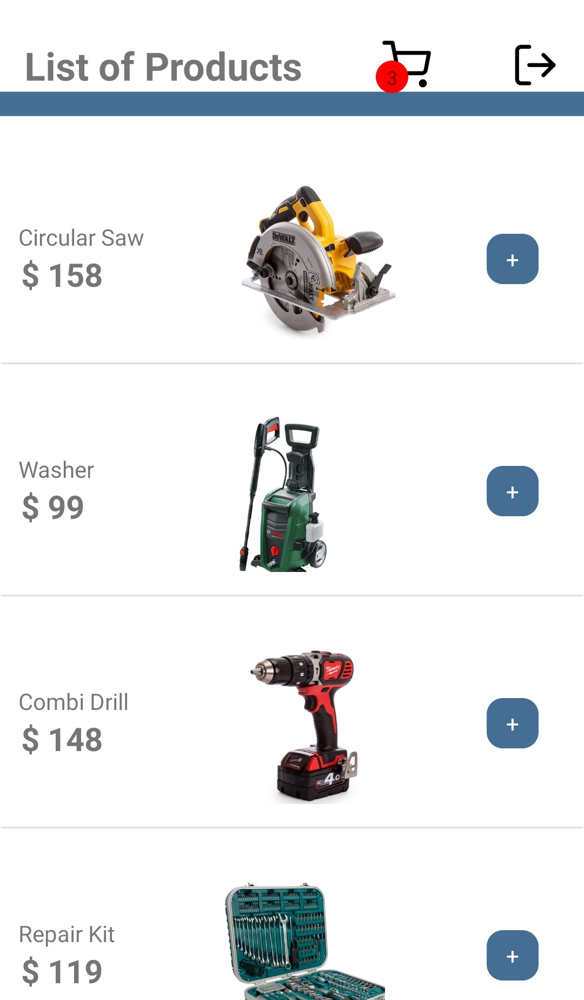
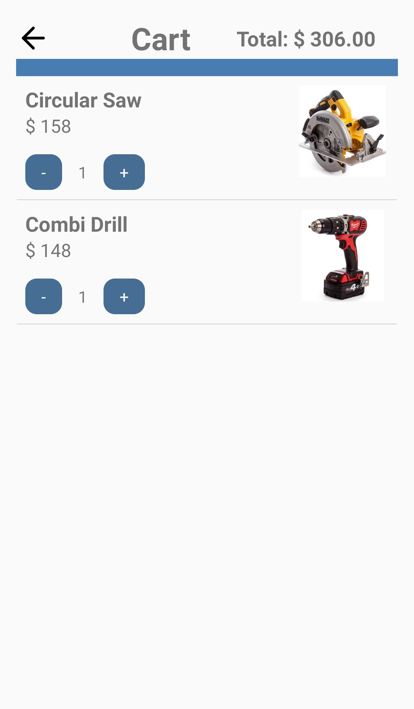

# project-e-commerce

### Project to display products from a store with their respective prices in the app, facilitating the sale of products and promotion of the store

 

**In this project is using:**  
- React Native CLI 
- Authentication screen through an external database to evaluate a customer who is entering the store's app. Only registered customers are allowed to enter, who can register on another screen, in order to log-in
- React Native's Context API to create global variables that will be used on more than one screen
- Stack-type React Navigation to navigate between the various screens of the app
- Cart icon with dynamic change of value on it
- The total value changes dynamically according to the addition or removal of products
- Vector-icons library to place icons
 

**Images:**

Log-in Screen

 
 

Registration

 
 

Virtual Shop

 
 

Cart with total

 
 
